# AI 接手

最后修改日期: 2026-05-23

## 1. 当前状态

这个项目经历过多阶段维护，旧根目录文档已经漂移。本文档记录文档清理后的当前基线。

给用户和 AI 接手看的快速结构图如下。图只表达交接主线，具体运行约束和风险仍以本文后续清单为准。

打开备注：下面是 Mermaid 图，需要用支持 Mermaid 的 Markdown 预览打开，例如 GitHub、GitLab、VSCode Mermaid 插件或 Mermaid Live Editor。AI 可以直接读取源码结构。

颜色层级：

- 灰色：当前项目基线。
- 蓝色：已实现能力。
- 黄色：接手时先看的 source of truth。
- 红色：当前风险和禁止动作。
- 绿色：下一步安全动作。

```mermaid
flowchart TD
    ROOT[AI 接手基线<br/>docs/AI_HANDOFF.md]

    ROOT --> STATE[已确认实现]
    STATE --> P1[Phase1<br/>SOP 关键词检索]
    STATE --> P2[Phase2<br/>SOP 语义检索]
    STATE --> P3[Phase3<br/>流式 Agent + Redis session]
    STATE --> P4[Phase4<br/>年报 PDF 解析与检索]
    STATE --> RULES[AI 规则迁移完成<br/>.ai-config/rules]

    ROOT --> SSOT[先读的稳定来源]
    SSOT --> MAP[docs/PROJECT_MAP.md<br/>架构图、边界、入口]
    SSOT --> SYNC[docs/SYNC.md<br/>环境、hook、settings 同步]
    SSOT --> CONFIG[.ai-config / .ai-hooks<br/>规则与 hook 主版本]

    ROOT --> RISK[接手风险]
    RISK --> DRIFT[旧根目录文档已漂移并清理]
    RISK --> QLOCK[嵌入式 Qdrant / Tantivy<br/>可能有本地锁竞争]
    RISK --> HASH[SOP collection 仍有 Python hash ID 风险]
    RISK --> V4[Phase4 只有检索端点<br/>还不是生成式 /v4/ask]
    RISK --> LINT[ruff 当前不是可阻塞基线]

    ROOT --> NEXT[安全推进]
    NEXT --> TEST[重构前跑匹配 smoke test]
    NEXT --> MILESTONE[继续 Phase4 前先拍板里程碑]
    NEXT --> PMAP[route / service / source of truth 变化时<br/>同步 PROJECT_MAP]
    NEXT --> NO_MIX[不要同一步混改 AI 规则和业务代码]

    classDef root fill:#f8fafc,stroke:#334155,stroke-width:2px,color:#0f172a
    classDef state fill:#dbeafe,stroke:#2563eb,color:#1e3a8a
    classDef ssot fill:#fef3c7,stroke:#d97706,color:#78350f
    classDef risk fill:#fee2e2,stroke:#dc2626,color:#7f1d1d
    classDef next fill:#dcfce7,stroke:#16a34a,color:#14532d

    class ROOT root
    class STATE,P1,P2,P3,P4,RULES state
    class SSOT,MAP,SYNC,CONFIG ssot
    class RISK,DRIFT,QLOCK,HASH,V4,LINT risk
    class NEXT,TEST,MILESTONE,PMAP,NO_MIX next
```

已确认实现：

- Phase1 SOP 关键词检索已存在。
- Phase2 SOP 语义检索已存在。
- Phase3 流式 Agent 对话已存在，使用 Redis session 和 `readFile` / `writeFile`。
- Phase4 年报 PDF 解析、入库、语义检索 API 已存在。
- 根 AI 规则已迁移到 `.ai-config/rules/**`，使用 `*.index.md` / `*.details.md` 路由。
- Codex/AI 现在是规则和 hook 的所有者；`.claude/` 只保留本机历史兼容。

## 2. 重要风险

- 旧的 `PROJECT_CONTEXT.md`、`TODO.md`、`docs/ARCHITECTURE.md` 已删除；稳定事实、易懂架构图、source of truth 统一以 `docs/PROJECT_MAP.md` 为准。
- `scripts/test_v4_report.py` 需要服务正在运行，并且年报数据已预先入库。
- 如果运行中的服务和进程内脚本同时使用嵌入式 Qdrant，可能竞争本地存储锁。uvicorn 正在运行时，优先走 HTTP 测试。
- `QdrantService.upsert` / `upsert_batch` 对 SOP collection 仍使用 Python `hash()`，Phase4 通过 `upsert_batch_to` 使用稳定 ID。不要在未检查实现前假设 SOP point ID 跨进程稳定。
- Phase4 当前暴露的是检索端点，不是最终生成式 `/v4/ask` RAG answer 端点。
- `ruff check --no-cache .` 当前会在继承代码库上失败，主要是风格、类型注解、`print`、宽泛异常等问题。应视为代码质量 backlog，不是文档清理引入的回归。
- 当前虚拟环境没有 `.venv/bin/basedpyright`。
- `market-impact-study/` 是相关规划工作流，不是核心 FastAPI 服务文档。

## 3. 下一步安全动作

1. 深层重构前，先运行与当前任务匹配的 smoke test。
2. 如果继续 Phase4，先拍板下一里程碑是 `/v4/ask` 流式生成，还是 event-study notebook 集成。
3. 只有当测试可维护性成为当前重点时，才把脚本式测试迁移到 pytest。
4. 如果 SOP collection 的向量 ID 稳定性变重要，检查并迁移 `upsert` / `upsert_batch` 到 `_stable_point_id`。
5. route、service 或 source-of-truth store 变化时，保持 `docs/PROJECT_MAP.md` 的易懂架构图同步。
6. 在把 `ruff` 设为阻塞 hook 前，先决定是否收紧当前 lint baseline。

## 4. 已完成清理

- 已在 `docs/` 下新增固定项目记忆文档。
- 旧根目录项目状态文档已删除，避免和 `docs/` 产生双源漂移。
- 生成缓存和截图残留不应提交。

## 5. 不要随手做

- 不要用 `--reload` 运行 uvicorn。
- 不要删除 `data/raw/`、`data/processed/` 或 `indexes/`，除非用户明确要求；它们虽然被 gitignore，但属于运行数据。
- 不要提交 `.env`、`.ai-config/settings.json`、`.claude/`、`.codex/`、缓存、截图、模型文件或索引文件。
- 不要在同一步同时改 AI 规则和业务代码，除非用户明确切换重心。
