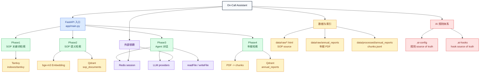

# 项目地图

最后修改日期: 2026-05-23

## 1. 项目目标

On-Call Assistant 是一个 FastAPI 应用，用于 SOP 检索和 Agent 辅助排障。

当前范围：

- Phase1：对 On-Call SOP HTML 文件做关键词检索。
- Phase2：使用 bge-m3 embedding 和嵌入式 Qdrant 对 SOP 章节做语义检索。
- Phase3：带 `readFile` / `writeFile` 工具和 Redis 会话的流式 Agent 对话。
- Phase4：面向 `market-impact-study` 工作流的年报 PDF 解析和 RAG 检索。

## 2. 易懂架构图

这张图优先用树状结构表达接手需要的主结构，不画所有内部调用细节。

打开备注：下面是 Mermaid 图，需要用支持 Mermaid 的 Markdown 预览打开，例如 GitHub、GitLab、VSCode Mermaid 插件或 Mermaid Live Editor。AI 可以直接读取源码结构。

颜色层级：

- 灰色：项目根。
- 蓝色：FastAPI 入口。
- 绿色：业务 Phase 分支。
- 黄色：数据、索引、chunk。
- 紫色：外部依赖和工具能力。
- 红色：AI 规则与 hook 体系。



## 3. 关键边界与 Source Of Truth

- Router 只做 HTTP/SSE 输入输出和 service 编排，不放索引算法、embedding 细节或 PDF 解析逻辑。
- Service 负责关键词检索、向量检索、PDF 解析、会话存储和 Agent 状态机。
- SOP 源文档：`data/raw/*.html` 加 `scripts/init_data.py` 生成的 metadata。
- SOP 关键词检索：Tantivy index，由已解析 SOP 文档生成。
- SOP 语义检索：Qdrant `sop_documents` collection，由 SOP 章节和 bge-m3 embedding 派生。
- Agent 对话状态：Redis session history。
- 年报源数据：原始 PDF 加 `data/processed/annual_reports/{company}_{year}/chunks.jsonl`。
- 年报检索：Qdrant `annual_reports` collection，由年报 chunk 派生。
- AI 规则：`.ai-config/` 和 `.ai-hooks/`；`.claude/` 只保留本机历史兼容。

架构图维护要求：route、service、运行数据源、外部依赖、source of truth 或关键边界变化时，更新本节架构图和边界说明。

## 4. 入口

| 入口 | 路径 | 用途 |
| --- | --- | --- |
| FastAPI 应用 | `app/main.py:app` | Uvicorn 应用入口 |
| 健康检查 | `GET /health` | 基础服务健康状态 |
| Phase1 页面/API | `/v1`, `/v1/search`, `/v1/documents` | SOP 关键词检索 |
| Phase2 页面/API | `/v2`, `/v2/search` | SOP 语义检索 |
| Phase3 页面/API | `/v3`, `/v3/chat`, `/v3/session/{id}` | Agent 对话和会话管理 |
| Phase4 API | `/v4/ingest`, `/v4/search`, `/v4/companies`, `/v4/health` | 年报 RAG 入库和检索 |
| 数据初始化 | `scripts/init_data.py` | 生成示例 SOP HTML 和 metadata |
| 阶段测试 | `scripts/test_phase1.py`, `scripts/test_phase2.py`, `scripts/test_phase3.py` | 脚本式 smoke test |
| Phase4 测试 | `scripts/test_report_pdf.py`, `scripts/test_v4_report.py` | PDF 解析和 HTTP 检索检查 |

## 5. 运行和验证

```bash
uv sync
cp .env.example .env
# 在 .env 中填入 LLM_API_KEY 或 provider-specific key。

# Phase3 需要 Redis。
docker run -d -p 6379:6379 redis:7-alpine

# 不要使用 --reload；Tantivy 和嵌入式 Qdrant 使用本地锁。
.venv/bin/python -m uvicorn app.main:app --port 8000
```

常用检查：

```bash
.venv/bin/python scripts/test_phase1.py
.venv/bin/python scripts/test_phase2.py
.venv/bin/python scripts/test_phase3.py
.venv/bin/python scripts/test_report_pdf.py
.venv/bin/python scripts/test_v4_report.py
```

`scripts/test_v4_report.py` 基于 HTTP client，需要服务正在运行且 Phase4 数据已经入库。

## 6. 目录职责

| 路径 | 职责 |
| --- | --- |
| `app/main.py` | 应用构造、路由注册、启动时锁清理 |
| `app/config/settings.py` | 基于环境变量的运行配置 |
| `app/routers/` | HTTP/SSE API 层和 HTML 页面端点 |
| `app/services/preprocessor.py` | SOP HTML 解析为可检索文档 |
| `app/services/indexer.py` | Tantivy 关键词索引 |
| `app/services/embedder.py` | bge-m3 embedding 服务，包含 query/passage prefix |
| `app/services/vectorstore.py` | 嵌入式 Qdrant collection 和向量检索 |
| `app/services/session_store.py` | Redis 会话存储 |
| `app/services/agent/` | LLM provider、工具、prompt 和状态机 |
| `app/services/report_pdf.py` | 年报 PDF 解析为章节 chunk |
| `app/services/report_indexer.py` | 年报 chunk embedding 和 Qdrant 入库 |
| `app/templates/` | Phase1-3 浏览器页面 |
| `scripts/` | 数据初始化、smoke test、memory/settings 辅助脚本 |
| `market-impact-study/` | 独立的事件研究规划文档 |
| `.ai-config/` | Codex/AI 规则 source of truth |
| `.ai-hooks/` | AI hook source of truth |
| `docs/TOOLING_CONTRACTS.md` | 工具契约维护入口：说明 ruff、basedpyright、import-linter、semgrep、pip-audit、pre-commit、CI 和 AI hook 的职责、运行位置、维护流程 |

## 7. 数据和运行产物

| 路径 | 状态 | 说明 |
| --- | --- | --- |
| `data/raw/` | 运行/输入数据，gitignored | SOP HTML 和年报 PDF |
| `data/processed/` | 运行生成数据，gitignored | 年报 `chunks.jsonl` 和派生数据 |
| `indexes/tantivy/` | 运行索引，gitignored | 关键词索引 |
| `indexes/qdrant/` | 运行索引，gitignored | 嵌入式 Qdrant 存储 |
| `.ai-config/settings.json` | 本地生成配置，gitignored | 包含本机 token |
| `.ai-config/settings.json.template` | 入仓模板 | 由 `.ai-hooks/manifest.json` 生成 |

## 8. 已知运行约束

- 不要用 `--reload` 启动 uvicorn；Tantivy 和嵌入式 Qdrant 可能留下本地锁，或竞争同一路径。
- Phase3 需要 Redis。Redis 不可用时，`/v3/chat` 应明确失败，不能静默降级。
- `LLM_PROVIDER` 通过 provider 单例缓存。修改 provider 配置后需要重启应用。
- bge-m3 向量维度是 1024。更换 embedding 模型需要重建 Qdrant collection。
- Phase4 年报解析需要 PDF 有可用书签；`report_pdf.py` 当前依赖 TOC 叶子标题。
