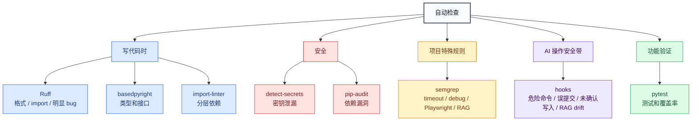

最后修改日期: 2026-05-23

# 自动检查怎么看

你只需要记住一句话：

**普通代码问题交给工具，业务取舍你拍板，工具和 hook 的维护让 AI 处理。**

## 一张图

打开备注：下面是 Mermaid 图，需要用支持 Mermaid 的 Markdown 预览打开，例如 GitHub、GitLab、VSCode Mermaid 插件或 Mermaid Live Editor。

## 你看到报警时怎么判断

### 1. 看起来像代码小问题

交给 AI 修。

常见来源：Ruff、basedpyright、import-linter。

你只需要问：这是机械问题，还是会改变业务行为？

### 2. 看起来像安全问题

先当真，不要直接提交。

常见来源：detect-secrets、pip-audit。

你只需要拍板：能不能升级依赖、能不能接受风险、这个值是不是敏感。

### 3. 看起来像项目特殊规则

先让 AI 解释为什么触发。

常见来源：semgrep。

它通常管 timeout、debug、Playwright、RAG 这类项目约束。规则不合理时，应该改规则，不要在代码里硬绕。

### 4. 看起来像 AI 操作提醒

先暂停一下。

常见来源：`.ai-hooks/`。

它通常在提醒：命令危险、可能误提交、还没确认就写文件、改 RAG 后忘同步数据、改名后引用没跟上。

### 5. 看起来像测试失败

让 AI 先判断失败类型。

常见来源：pytest。

测试失败可能是功能坏了、环境不对，也可能是测试过期。测试通过也不等于需求完整。

## 你不用记的事

这些由 AI 和 CI 维护：

- 哪个工具在 pre-commit 跑。
- 哪个工具在 CI 跑。
- hook 是否已注册。
- semgrep 文件是否已登记。
- registry 和文档是否漂移。

如果你怀疑这些东西乱了，直接让 AI 检查“工具契约”。

## 给 AI 维护时看的文件

- `.ai-config/tooling.registry.toml`：机器登记表。
- `.ai-config/check_rule_tool_contracts.py`：自动检查脚本。
- `.ai-hooks/manifest.json`：hook 注册源。
- `.pre-commit-config.yaml`：本地提交前检查。
- `.github/workflows/ci.yml`：CI 检查。

人优先看本文；AI 维护时必须看上面这些文件。
